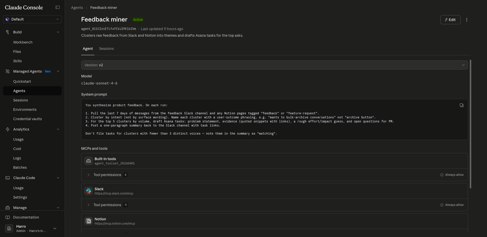
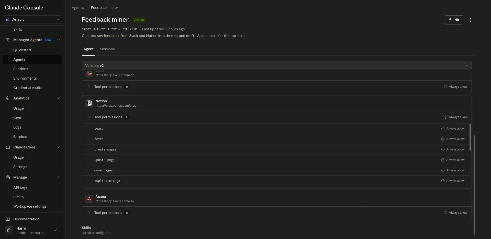
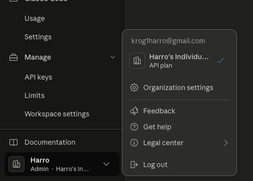
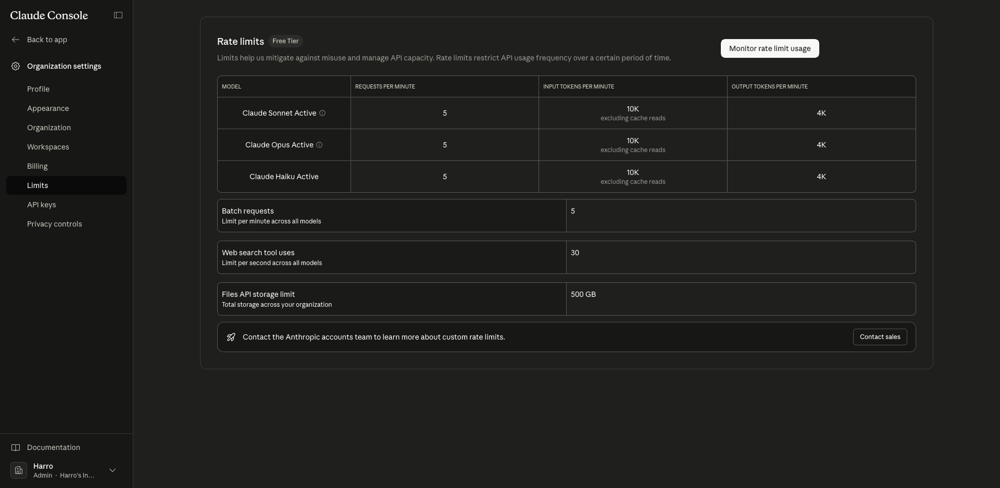
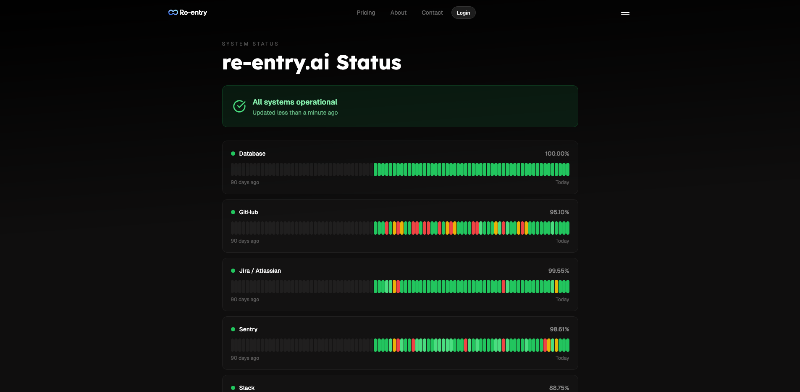

# MAKE SDK WORK IN ANY LANGUAGE

Extism (extism.org) — WASM-based plugin system. Developers write skills in any
language (Rust, Go, Python, JS, C), compile to .wasm, and your runtime loads
them into a single process. No containers per skill, no build pipelines. SDKs
exist for most languages. You'd get the "upload a zip" DX you have now but
language-agnostic. The host (your skill-runtime) provides host functions for
HTTP, credentials, logging — which maps directly to your SkillContext.

OpenFaaS — if you want the container-per-skill model. Handles build, deploy,
scaling on K8s. But it's a whole platform to operate and overkill for your
scale.

No. You wouldn't sacrifice anything. Extism gives you:

- Same single-process model (no containers per skill)
- Same upload-a-file DX (.wasm instead of .zip)
- Same sandboxing (WASM is more isolated than Node.js eval, actually)
- Same host-controlled I/O (you provide fetch/credentials as host functions,
  just like SkillContext)
- Any language that compiles to WASM

The only cost is time:

1. Rewrite the skill-runtime executor to load .wasm modules instead of esbuild
   bundles
2. Write the host functions (fetch, log, credentials) as WASM imports
3. Build a compile step per language (TS→WASM, Python→WASM, Go→WASM)
4. Rewrite or adapt the three existing skills to target WASM
5. The manifest/defineSkill contract stays the same — it's just how execution
   happens underneath

No architectural trade-off, no new services to operate, no K8s complexity
increase. It's a pure upgrade path. The reason I said "don't do it yet" is only
time — it's weeks of work to replace something that works fine today for a
capability nobody is asking for yet.

---

# Add loading placeholder skeleton

Just add meaningful skeleton placeholders. Especially an anti pattern is that we sometimes show wrong default values instead of waiting for the correct values. Add meaningful error popups if something goes wrong.
Especially in enterprise rather show something got wrong than showing something wrongly

---

# Agent visualization

This is not refined right now but it would be cool to see like dependencys between agents and skills.
Like for paperclip which shows the org structure.

---

Make agent panel less tab heavy. Claude also does have managed agents it also has the same functional sidebar layout and it shows that you can put all the menaingful information on one page.

Claude only has one prompt, mcp tools  but it shows how to abstract tools well. Basically the abstraction is that you dont have to separarte tools and skills. Also skills i the industry has been established as just knoweldge.
Our abstraction for a skill hub is thus incorrect we should reframe them as tools. Thus The agent detaiils should follow claudes layout. I would probably propose one agent tab which includes a chat -> system prompt -> tools

The second tab sohuld be sessions.

Then we would want a logs tab

And a memory tab which also isnt perfect currently.The problem with system prompt in claude agents is that it is really just a single prompt. In our implementation its made up of several files. We would need to brainstorm about that. But id say openclaw established
that a system prompt made out of those files is good. WE shouldnt reduce t hat. So id probably propose just put Prompt into a separate tab since its complex.
And separate memory from prompt although both should be stored in obsidian

Also they have an icon per mcp because those obviously are mcp servers we can instead just use our emojis which we have already established however i am currently considering making it look more mature by adding new images. Lets also tlak about that.

Also providers really shouldnt be a sidebar element has like a way better sdebar we can just copy that basically. Its a really good way especially because it at the bottom allows for org settings which we really need. One person could then setupthe api key and that should work. So api key should be in settings . Also claude code has a really cool sidebar animation if switching to organizational settings it changes the whole sidebar into a new view. This transition is really good but for now we just need to think about the organizational settings.  the image shows that the sidebar then basically has a back to main app button we should implement it exactly like that. Because there are system administrators which need to do heavy config. This is liek the perfect ui layout for the coming complexity regarding enterprise. Where stuff like privacy controls, rate limiting, team setup and so on would be configured from there.

also remove new agent from sidebar

The philosophy is Main app is for the consumer accpetance criteria is even a non technical person should instantly understand whats going on and not have to think about any config or permission they should just be subject to it.

\*Conclusion after talking:

**Sidebar restructure:**

- Remove Platform section (Providers, Skills, Runners) from main sidebar entirely → move to Org Settings
- Main sidebar: Dashboard, Agents, [future: Knowledge Graph], then bottom: Org Settings + Account/Logout
- Org Settings gets the Claude Code sidebar transition — clicking it replaces the full sidebar with an org-settings view that has a "Back to main app" button at the top. This is the right pattern for the coming enterprise complexity (privacy controls, rate limiting, team setup, API keys, runners config).
- "Active Agents" section stays in sidebar as-is (it's operational, not config)
- Agent creation lives as a big button inside the Agents tab — confirmed correct, do not add it back to the sidebar

**Rename Skills → Tools everywhere** (skills = knowledge in the industry; tools = callable capabilities — our abstraction is wrong, fix it)

**Agent detail panel — 5 tabs:**

1. **Chat + Tools** — operational interface, chat window + assigned tools list with emoji icons
2. **Prompt** — separate tab because our system prompt is a vault of files (CouchDB/Obsidian), not a single text field; cannot collapse this
3. **Sessions** — session history
4. **Logs** — tool execution logs
5. **Memory** — what the agent has learned; separate from Prompt even though both live in Obsidian (different concerns: behavior vs. learned context)

**Icons:** Keep emojis for now, they work and are distinctive. Revisit when there is a clear reason to upgrade.

---

# Obsidian

We want to use obsidian as the only source for knoweldge. I know that partially it has already been established that at least the system prompt is pulled from couchdb.
But we need to provide the agent with a meaningful way of interacting with the organizations knowledge graph.

We have built the skill for it /Users/harrokrog/Desktop/EnterpriseAgentOs/packages/skills/obsidian which is the skill to interact with the knowledge graph trough the cli. But maybe we would need to make it actually native tools. But the cli is so komplex and we need that complexity to all persist. So Id suggest we should talk about that again

This org wide knoweldge graph also needs to be a new tab in the sidebar.

\*Solution after talking:

**Agent ↔ knowledge graph access (already solved):** The obsidian skill already exposes discrete, typed tools (read_note, search, get_backlinks, find_by_tag, etc.) via the skill SDK. obsctl is just the execution engine — the agent never sees raw CLI. No architecture change needed here.

**Human ↔ knowledge graph (sidebar tab MVP):** Add a Knowledge Graph sidebar section. MVP scope: file tree + full-text search + markdown preview. Graph visualization (nodes/edges) is v2. The CouchDB connection for this tab is an org-level config (org settings), not per-agent.

**System prompt — continuous memory updates:** Agent system prompts must explicitly instruct agents to treat the knowledge graph as their external memory and update it continuously. Guided by the philosophy in `/Users/harrokrog/Documents/Optimierung/README.md`:

- After completing tasks, the agent appends findings to existing relevant notes before creating new ones (text-dump-first: only atomize when a note exceeds ~500 lines or is referenced from many places)
- When creating a note, always set `category` (one per note, defines identity) and `tags` (sparse, multi-dimensional, only when a concept genuinely spans categories)
- Use the org's template per category when creating structured notes (`apply_template`)
- Link notes using `[[wikilinks]]` in content to build the graph — the graph is the structure, not the folder hierarchy
- Folders are architecture only; agents should file notes by the org's folder convention, not invent new folders

**Tool gaps to fix — tags, categories, bases must work:**

- Tags: `find_by_tag` exists ✅
- Categories: `get_properties` / `set_property` can read/write a `category` frontmatter field, but there is no `find_by_category` action — **add `find_by_category` to the obsidian skill**
- Bases: Obsidian Bases are filtered views of notes by property. obsctl likely doesn't support this yet — **add bases/filtered-property-query support to obsctl and expose it as a tool**

---

# Enterprse auth

I really dont know if enterprise auth is any different but right now there is no way to join enterprises we would need to talk about that
Probably we would need to support more auth methodes such as github, microsoft, iam from aws and so on.

\*Solution after talking:

**Standard: OIDC (OpenID Connect) + SAML 2.0**

- OIDC is the primary protocol — covers Google, GitHub, Microsoft (Entra ID), AWS IAM Identity Center, all modern IdPs
- SAML 2.0 is required for large enterprises on Okta, Azure AD legacy, OneLogin, PingIdentity — a hard blocker without it

**Implementation: WorkOS** (not DIY)

- Single API abstracting OIDC, SAML 2.0, and SCIM (directory sync)
- Per-org connections: each enterprise customer configures their own IdP once, all employees SSO automatically
- C# backend integrates via WorkOS SDK — no hand-rolled SAML state machines

**SCIM (user provisioning) is mandatory for enterprise:** when an employee leaves, their agent access must auto-revoke. This is a compliance requirement, not a nice-to-have.

---

# Agent skill assignemnt

Pretty easy skill right now all skills are always attached to every agent we would want to at setup decide which skills we want, or later mnaully changing them

---

# Coding agent

I am currently thinking about building a coding agent which integrates with the network. because obviously the same as for long running agents goes for coding agents in a way that they are unstructured. This agent would have access to our knowledge graph. But really this can be pushed long into the future because right now no one really does coding agents on api billing i think everyone just uses the claude subscription but idk

But we would need to add a really mature coding agent skill. I am not sure if that is as hard as i imagine it. Basically any coding agent would clone a repository and shgould work on it in a isolated enviroment. We can again inject api keys pretty easily and it should "just work"
I am currently questioning if a coding agent is so custom that it should not just be a npm package lets talk about that. But thats just intuition and i cant really reason why.

\*Solution after talking:

**Don't build a coding agent from scratch — fork opencode.**

opencode already solves the hard problems: file editing, diff application, shell execution, multi-turn coding loop. Our contribution is:

- Strip the TUI entirely — no interactive terminal needed, headless only
- Inject the LLM provider via our backend (consistent with "credentials never leave the backend" — the fork receives a provider config, not raw API keys)
- Run in an isolated environment using **git worktree** — fast (same object store, no clone), isolated per task, own branch, clean to remove after
- Called as an async tool by the orchestrator agent — main agent fires the task, coding agent works independently, returns result (branch name, PR link, summary)

**Why not a subagent within the same agent, or a native Rust implementation:**

- Competing with opencode/Claude Code on coding UX is the wrong move — users have strong tool preferences
- Our position is orchestration and org management, not coding execution
- opencode's engine is the right foundation; we just make it programmable and headless
- Coding agents are fundamentally seemingly the same but trying to balance zeroclaw fork beeing a coding agent and a orchestrator at the same time would be to complex

**Delay:** This is a real engineering effort. Ship everything else first. Revisit when there is a concrete customer need for it.

---

# Own model

Like opencode we could implement a model router so users dont have to bring their own keys

But most importantly we should implement model forwarding so that we basically resell the models.

# Stripe

This goes right along with stripe. Since we are b2b idk if a simple SAAS pricing is good but i guess so. We should integrate stripe probably having 3 tiers where tier 3 would be a custom contact us enterprise tier. We sohould really consider pricing structure and to what way we wanna integrate normal users. I can imagine actually being able to distribute this service for free to regular users and making b2b pay. This is like a pretty well regarded business model which YC loves. ALso we need to consider open source.

We should thus probably add a simple pricing page https://re-entry.ai/pricing

\*Solution after talking:

**Model strategy: resell models, no BYOK in SaaS** (BYOK is a future self-hosted concern, not in scope now)

**Smart model routing is what makes the economics work** — not every call goes to Sonnet. Haiku handles simple tool calls and routing decisions, Sonnet handles actual reasoning. Real blended cost lands at ~$3-5/M tokens across a typical workload. This routing is itself a product feature.

**Model cost reference (retail, pre-volume-discount):**

- Haiku: ~$0.50/M blended
- Sonnet: ~$9/M blended
- Opus: ~$45/M blended

**Typical agent usage:**

- Light agent: ~1M tokens/month
- Active agent: ~3M tokens/month
- Heavy agent: ~8M tokens/month

**3 tiers — limits on concurrent agents + token bundle, all features available at every tier:**

|                   | Free       | Team        | Enterprise |
| ----------------- | ---------- | ----------- | ---------- |
| Price             | $0         | $249/mo     | Custom     |
| Concurrent agents | 1          | 10          | Custom     |
| Tokens included   | 2M/mo      | 25M/mo      | Custom     |
| Our model cost    | ~$10       | ~$100       | —          |
| Gross margin      | −$10 (CAC) | ~$149 / 60% | target 65% |

Enterprise starting point: ~$1,500–3,000/month. Justified by SSO (WorkOS), SCIM, compliance, and dedicated support — all of which have real cost to serve.

**On power users:** Heavy agents at full Sonnet load can flip a Team subscription to a loss (25M tokens at Sonnet = $225 in model costs vs $249 revenue). This is expected — every company loses money on power users (AWS, Notion, Figma all do). We accept this as normal. The pay-as-you-go model (see below) ensures we never run at sustained loss on a single customer.

**Profitability path is not only token price drops:** Revenue grows as we add customers, model routing improves, volume discounts kick in, and the platform expands (coding agents, channel integrations, marketplace). The business has multiple expansion levers beyond model cost reduction.

**Pay-as-you-go after threshold (Cursor model):** Inspired by Cursor's pricing — every plan includes a token bundle, after which on-demand usage kicks in automatically, billed in arrears. No hard cutoff that breaks an agent mid-task. Users see their usage dashboard and get notified as they approach limits. This solves the power-user margin problem without punishing them.

- Overage rate: our model cost + markup (e.g., cost × 1.3) — we never lose money on overage
- Enterprise gets pooled token budgets across all agents + invoice/PO billing instead of card

**Implementation:** Stripe for subscriptions + Stripe usage-based billing (metered) for token overage. Add a pricing page.

---

# publishing skills publicly

Since we are b2b the default should be private within the organization but we should encourage poeple to publish their tools. Like clawhub. So that our skill network grows.

---

# Product video and custom assets

Our landing page right now just follows the template. I actually really like the template is pretty good. However the grid still bugs me a little. But most importantly we need to have a really good product video.
And we need custom elements for the how our product works and for the feature section.

We really wanna respect the yc blueprint which i built especially the product showcase and features. I really feel like right now we have to much features too little showcase /Users/harrokrog/Documents/Optimierung/References/YC Website Blueprint.md
For verification if our website is really good another agent should apply those 50 principles ciritcally /Users/harrokrog/Documents/Optimierung/Clipping/YC Landing Page Teardown 50 Lessons.md We should also keep that in mind during the devleopment of the idea

Also we can establish that we dont need to resell what Openclaw is. Its common knoweldge as of now. So stuff like personalized prompt or persistent memory wount hit at all.

Mind i am just a technical person and i am listing technical features. We would need a YC Sales agent to look at that data and show how we wanna sell that and what we wanna sell.

Also ther is a problem with our hero section its just way too long /Users/harrokrog/Documents/Optimierung/References/YC Website Blueprint.md says ut shiykd be short. 10-14 words i feel still is really generous. The fundamental problem is that yc wants a format like we do .... for ...
But our goal kinda is to help everyone we dont double down on a specific industry. Basically i just want it shorter also our headline feels like its already listing features

**Important features**

- Custom skills which really integrate within the local network of a company
- Company Wide knowlege graph
- Really quick and cheap agents
- Decoupeling tools from the actual sandbox; I feel this alone dosent say anything; The implications are we have hgighly custom tools (We need to make away more custom skills like 100+ of the most used ones for the iniital mvp) this is what people love about openclaw. Firstly clis are way better for the agent than mcp because its not a token dumbp. Secondly you can integrate with services which you usually canty interact with like the gog cli allows to seamlessly integrate like with all google services. Same probably goes for a lot of other stuff. Also obviously easily allows to reuse skills
- Agents integrating in any channel
- selfhost the agent skill runner
- Generally the state of the art before with openclaw has been outlined by me several times its awful especially for enterprises. Our software is easy, quick and stable
- ... There probably are more selling points
- Computer use relay i feel like no company will use that becasue its just a tech demo but add verification, logging and stable in house relays and it might be another think
- browser relay
- Really the value statment is that everything just works

The point is we need to make really cool interactive graphics out of that. Thats the new state of the art in yc. You dont just say we do ... but you show like a custom animation for it. Also hih quality screen recordings of the own application are really good. That nowadays is really simple with ai models. Gemini for example easily creates custom animated svgs. Or in react you can also pretty easily create custom stuff.

We actually dont wanna rely that much on nano banan and any image generation. I have noticed that yc SAAS b2b compabies never do that.

---

# Agent in any channel integration

That is like a main feature of openclaw and right now we dont have it. The agent obviously should integrate to any channel like microsoft teams, whatsapp, telegram ....

---

# Computer use relay

Claude computer use already exists and with a custom docker container you can actually allow it to control your computer. We basically wanna clone that software and make it work in the cloud for us. And most importantly trough relays. The user would need to like install a part of their software. The dashbaord should somewhere show that. idk about how we wanna abstract it because its not really a tool but its also not a separate agent. Maybe it actually is a separate agent. I imagine the usecase to be that there for sure must be a 1 to 1 assignment of agents to a realy becauses the agent needs to know about the computer a lot and that context would pollute other agents. Thus it would really just be a abstraction to a tool. So the agent would be called like a tool but is a separate agnet. Also tool dosent await direct response but would be an async task like a coding agent.

We would need to think about where to put that in the dashboard. For sure not in tools. Maybe really put them under the agents tab. And just add a window if they are a relay. this should show instantly what the agnet is doing. Lets talk about that further though.

1. intend post something on linkedin
2. does its thing might take some time and retrying and so on ...
3. Last step is agent is done and sends response or if error it should send an error with a meaningful message

# Browser

This also kinda goes hand in hand with it. This however is way higher priority. We basically cant sell our product if we dont have a browser working. The current state of the art that any agent has their browser internally. But obviously i wanna decouple the browser too. WE would for usre need to persist session cookies and so on. Also we cant get banned. But i actually have a libary for that. Also I think openclaws using the browser never really gets banned. They just use playwright. Ik that there is like a libary for making playwright more human thats good too.

# Proxy network

Idk if we want a proxy network that seems pretty shady to me

---

# Relay only skills os specific

I imagine for the apple notes skill that skill would actually work if the user installed a relay on their device. The agent could then execute the skill on their system. see https://github.com/antoniorodr/memo

---

# Blog, Privacy Policy and Terms

For blog use a blog i actually dont know about that. Because i dont wanna write meaningless stuff. Also i dont like if companys write blogs which obviously just are there to sell their product.
However i would still imagine we could write something like why openclaw isnt enterprise ready. Making it just a little more casual.
Also i could write an entry about winning the hackathon. (We won the disability hackathon which didnt really have anything to do with the current project but i would still wanna use it as social proof)

The terms of service and privacyt policy should really make us not accountable for anything failing.
But sicne we are doing enterprise maybe we should consider taking some accountability. Usually

---

# Add downtime view

To proof that they can trust our infrastructure we should show a state of the art downtime panel referenced in the footer
something like that 

---

# MCP and CLI for access

Generally we want to provide access not only trough the dashbaord but also trough a cli and mcp server
example https://re-entry.ai/features/mcp-gateway
