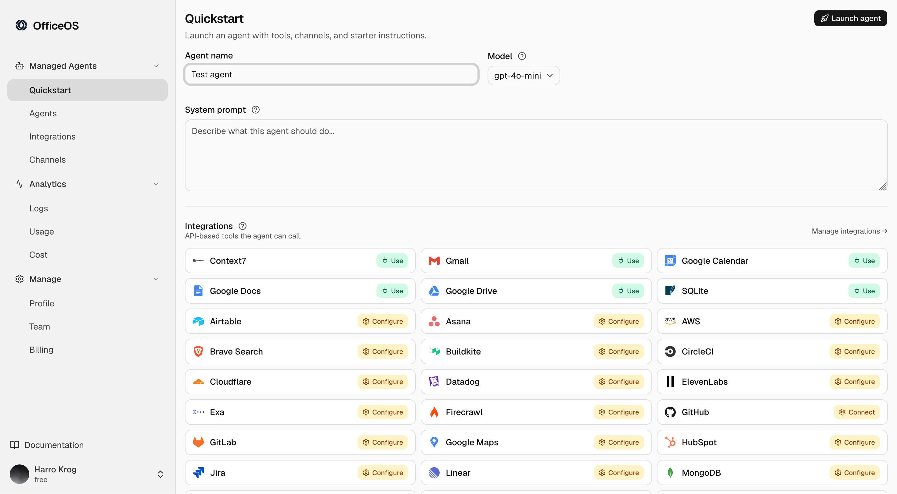
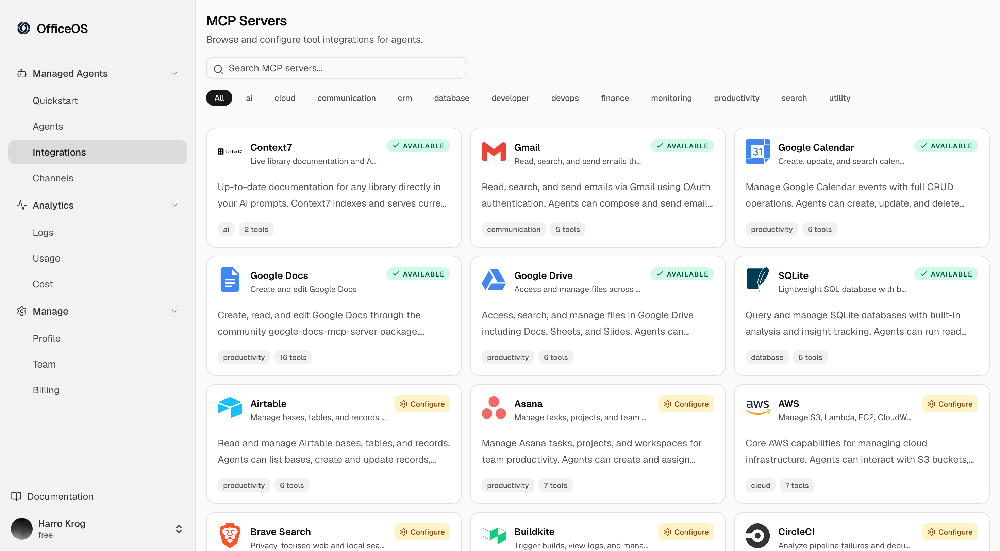
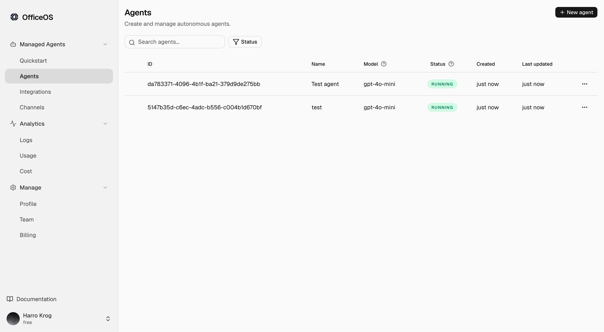

<p align="center">
  <picture>
    <source media="(prefers-color-scheme: dark)" srcset="apps/website/public/logo-white.svg" />
    <source media="(prefers-color-scheme: light)" srcset="apps/website/public/logo.svg" />
    
  </picture>
</p>

<h1 align="center">Open-source infrastructure to scale AI agents</h1>

<p align="center">
Deploy, host, and manage agents with tools, memory, credentials, logs, and isolated workspaces from one control plane.
</p>

<p align="center">
<a href="https://officeos.co">Website</a> · <a href="https://docs.officeos.co">Docs</a> · <a href="https://docs.officeos.co/quickstart">Getting Started</a> · <a href="https://github.com/HarKro753/EnterpriseAgentOs/issues">Issues</a>
</p>

<br/>

OfficeOS is the infrastructure layer for running AI agents in production. Self-host the application, then give every agent its own virtual environment with an attached browser, tools, persistent memory, credential access, structured logs, and an isolated workspace.

The dashboard is the control plane for deploying agents, managing their capabilities, observing every turn, and operating them across teams and environments.

Self-host the full stack with Docker Compose or Kubernetes.

## YC Application Video

<video controls width="100%" poster="docs/assets/OfficeOsScreen1.png">
  <source src="docs/assets/YcApplicationVideo.mp4" type="video/mp4" />
  <a href="docs/assets/YcApplicationVideo.mp4">Watch the YC application video</a>
</video>

[Watch the YC application video](docs/assets/YcApplicationVideo.mp4)

## Dashboard Preview

| Quickstart                                                                                                                      | Integrations                                                                                           | Launch setup                                                                                                   |
| ------------------------------------------------------------------------------------------------------------------------------- | ------------------------------------------------------------------------------------------------------ | -------------------------------------------------------------------------------------------------------------- |
|  |  |  |

## Highlights

- **One control plane** — deploy, host, configure, and observe agents from the dashboard
- **Virtual environments** — every agent gets an isolated workspace with filesystem and shell access
- **Attached browsers** — every agent has browser capabilities for web workflows and automation
- **Managed tools and MCP** — connect agents to built-in tools and MCP servers for external integrations
- **Persistent memory** — store agent memory, conversations, and operational context centrally
- **Credential management** — give agents scoped access to provider keys and integration secrets
- **Structured logs** — inspect message, tool call, tool result, and agent output timelines
- **Model-agnostic** — bring your own LLM keys for Anthropic, OpenAI, Google, xAI, and compatible providers

## Quick Start

For local development, the root `.env` file is the source of truth for runtime
config and secrets. Copy the template once, edit the provider keys, then start
the development infrastructure from the repo root.

```bash
git clone https://github.com/HarKro753/EnterpriseAgentOs.git
cd EnterpriseAgentOs

cp .env.example .env
# Edit .env: add at least one LLM provider key

docker build -t harkro123/eaos-pod-executor:latest packages/pod-executor
docker compose -f docker-compose.infra.yml up -d
```

## Kubernetes

OfficeOS is built for self-hosters who want to run agent infrastructure on their own cloud. Kubernetes manifests are available under `k8s/` for production and staging deployments.

```bash
kubectl apply -f k8s/prod/
```

You can also install the core control plane with Helm:

```bash
cp k8s/helm/examples/values.local.example.yaml values.local.yaml
# Edit values.local.yaml with your database, public URLs, and provider keys.

helm upgrade --install eaos ./k8s/helm \
  --namespace eaos \
  --create-namespace \
  -f values.local.yaml
```

## Development

Run infrastructure in Docker and run product code on the host for fast rebuilds.
The backend creates one pod-executor container per agent and binds it to a random
localhost port, so local `dotnet run` can call agent runtimes directly.

```bash
# Infra: Postgres, Redis, MinIO, channels, browser controller, browser node
docker compose -f docker-compose.infra.yml up -d
# Rebuild this when packages/pod-executor changes
docker build -t harkro123/eaos-pod-executor:latest packages/pod-executor

# Backend
cd apps/backend && dotnet run --project src/EnterpriseAgentOs.Api

# Dashboard
cd apps/dashboard && bun dev
```
